# Activity Diagrams - Ineri Suki & Grill (Revisi Lengkap per Fitur)

Dokumen ini berisi kumpulan Activity Diagram untuk seluruh fitur website. Diagram dipisah satu per satu sesuai dengan fungsi fitur masing-masing, dan dibuat menggunakan standar UML Activity Diagram dengan format *swimlane*. Sesuai format, **aktor (PENGGUNA / ADMIN)** selalu berada di lajur **kiri**, dan **SISTEM** berada di lajur **kanan**.

---

## A. FITUR PENGGUNA (PELANGGAN)

### 1. Fitur Registrasi (Pengguna)
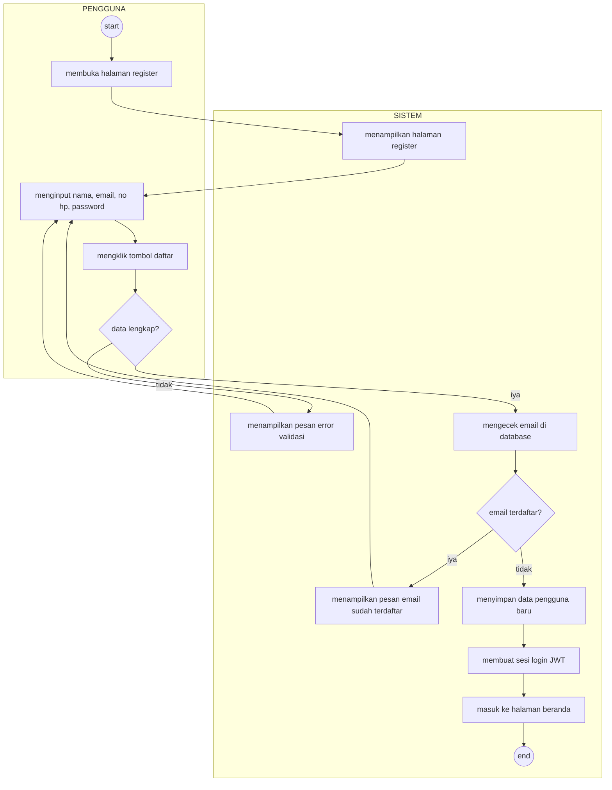

### 2. Fitur Login (Pengguna)
```mermaid
flowchart TD
    subgraph PENGGUNA
        direction TB
        start((start))
        buka[membuka halaman login]
        input[menginput email dan password]
        klik[mengklik tombol login]
        cekKosong{data kosong?}
    end
    
    subgraph SISTEM
        direction TB
        tampil[menampilkan halaman login]
        pesanKosong[menampilkan pesan "please fill out this field"]
        ambilDB[mengambil data dari database]
        cekDB{data valid?}
        pesanSalah[menampilkan pesan "email dan password salah"]
        masukUser[masuk ke halaman beranda]
        selesai((end))
    end
    
    start --> buka
    buka --> tampil
    tampil --> input
    input --> klik
    klik --> cekKosong
    cekKosong -- iya --> pesanKosong
    pesanKosong --> input
    cekKosong -- tidak --> ambilDB
    ambilDB --> cekDB
    cekDB -- tidak --> pesanSalah
    pesanSalah --> klik
    cekDB -- iya --> masukUser
    masukUser --> selesai
```

### 3. Fitur Melihat & Mencari Menu (Pengguna)
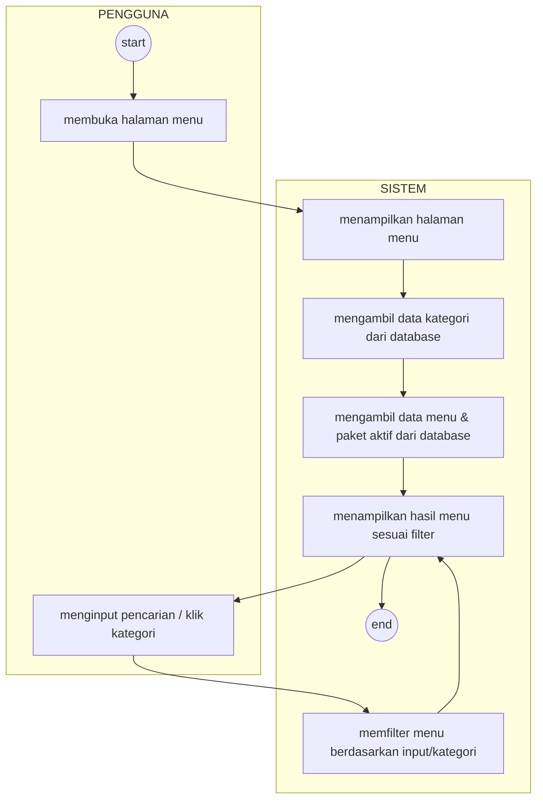

### 4. Fitur Mengelola Keranjang (Pengguna)
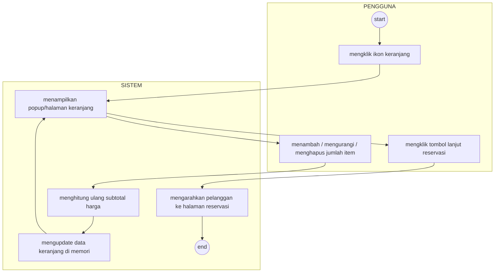

### 5. Fitur Reservasi & Checkout (Pengguna)
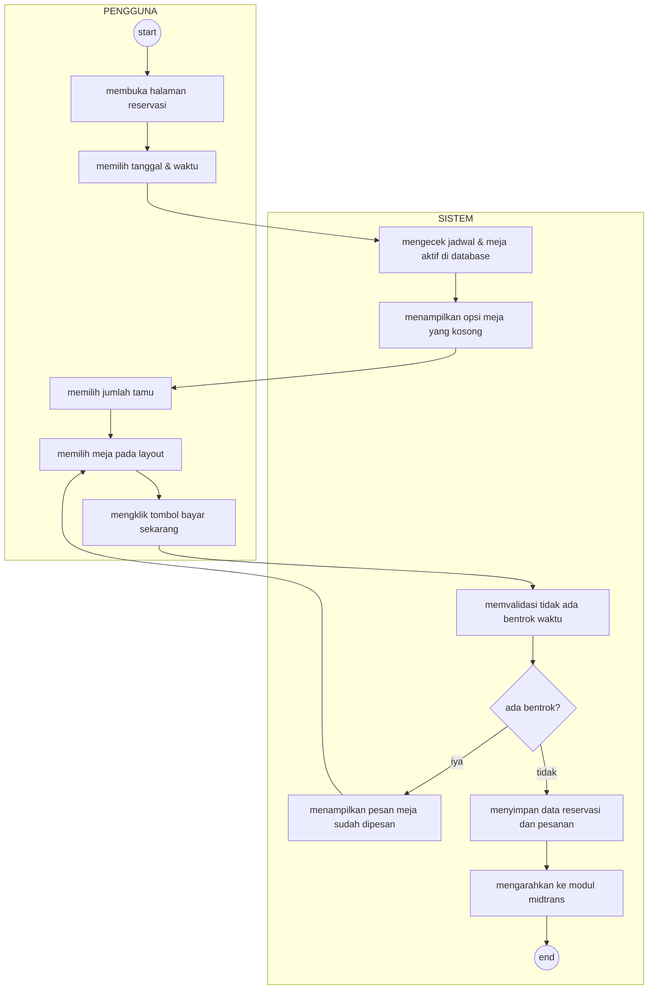

### 6. Fitur Pembayaran Midtrans (Pengguna)
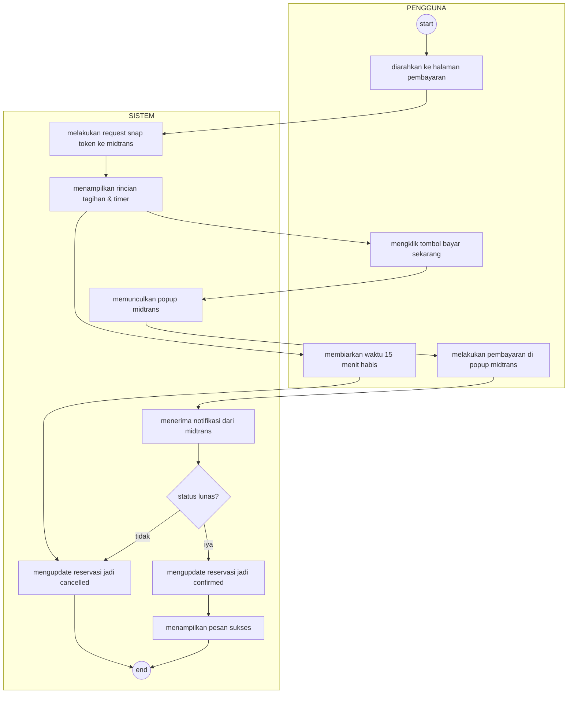

### 7. Fitur Melihat Riwayat Pesanan (Pengguna)
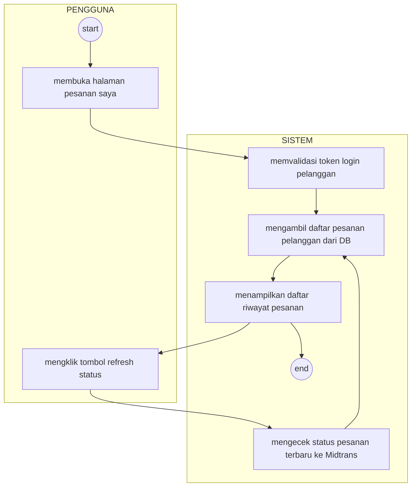

### 8. Fitur Pengajuan Refund (Pengguna)
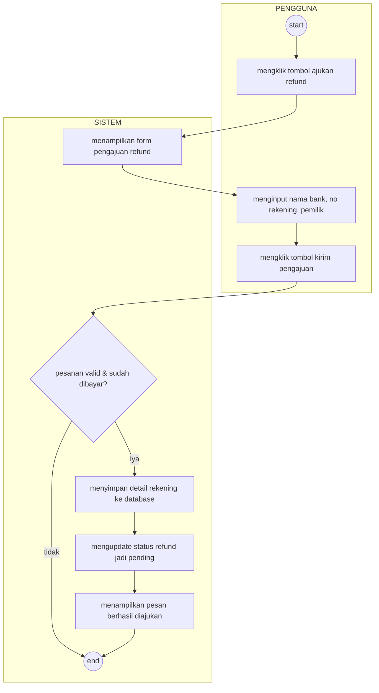

---

## B. FITUR ADMIN (PEGAWAI)

### 9. Fitur Login Admin
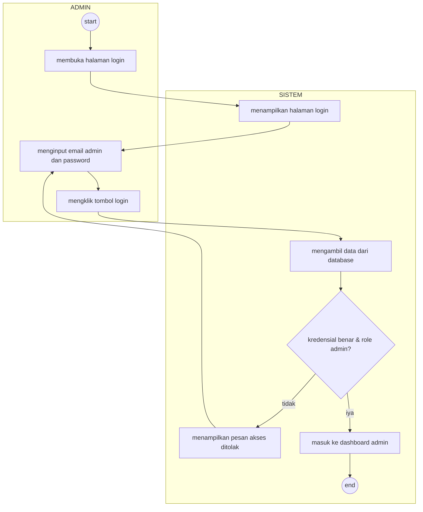

### 10. Fitur Kelola Menu (Admin)
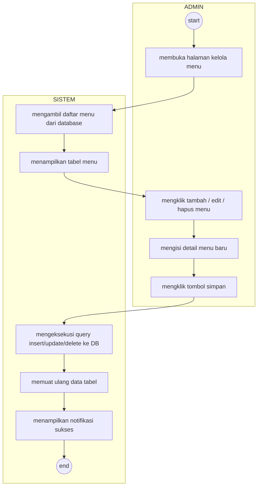

### 11. Fitur Kelola Kategori Menu (Admin)
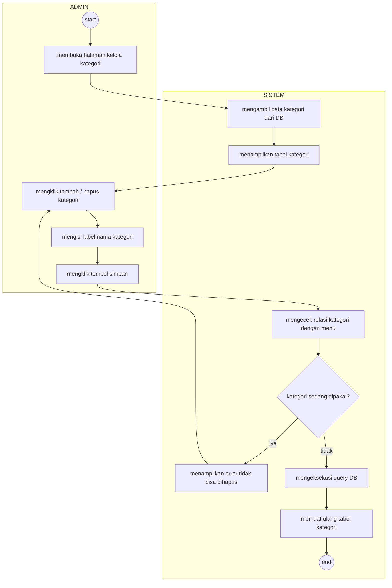

### 12. Fitur Kelola Reservasi (Admin)
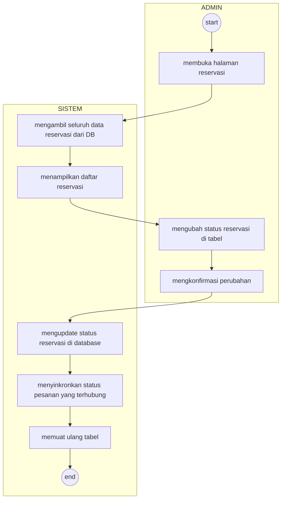

### 13. Fitur Kelola Pesanan (Admin)
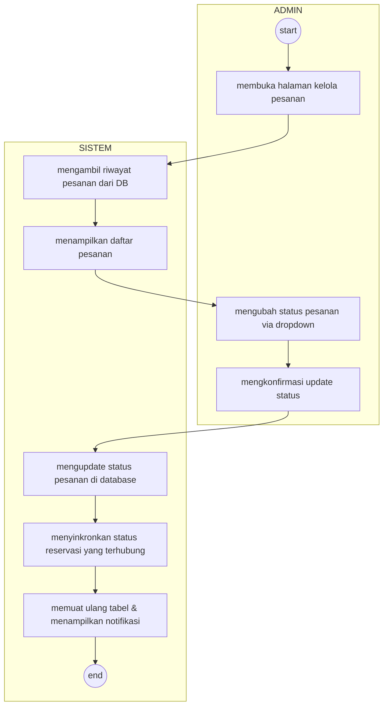

### 14. Fitur Memproses Pengajuan Refund (Admin)
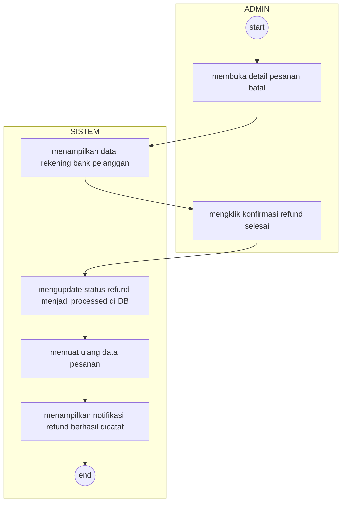

### 15. Fitur Kelola Meja (Admin)
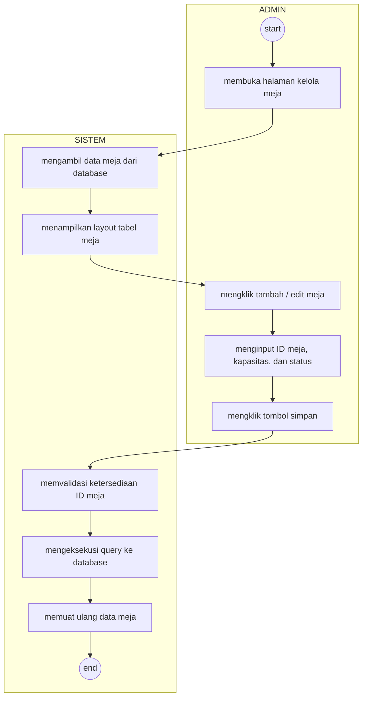
