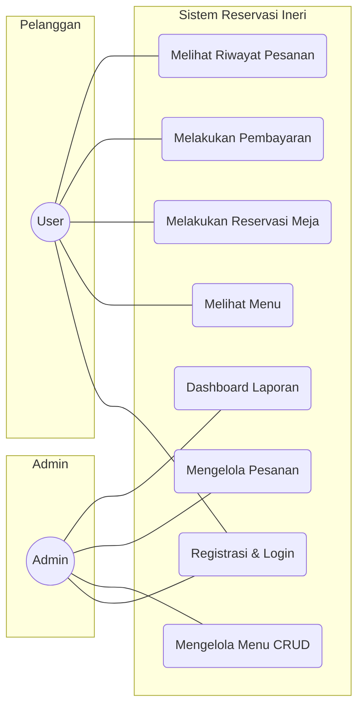
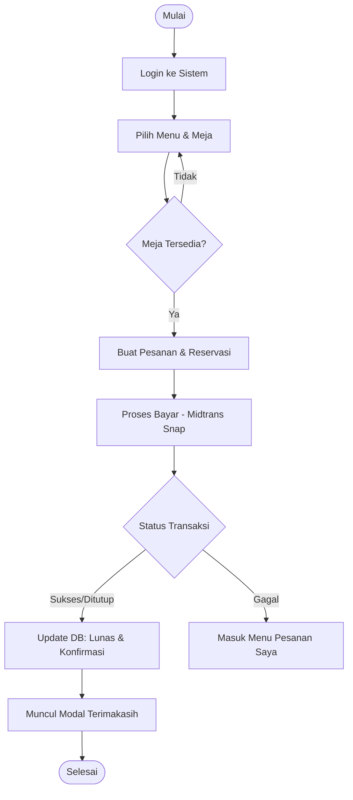
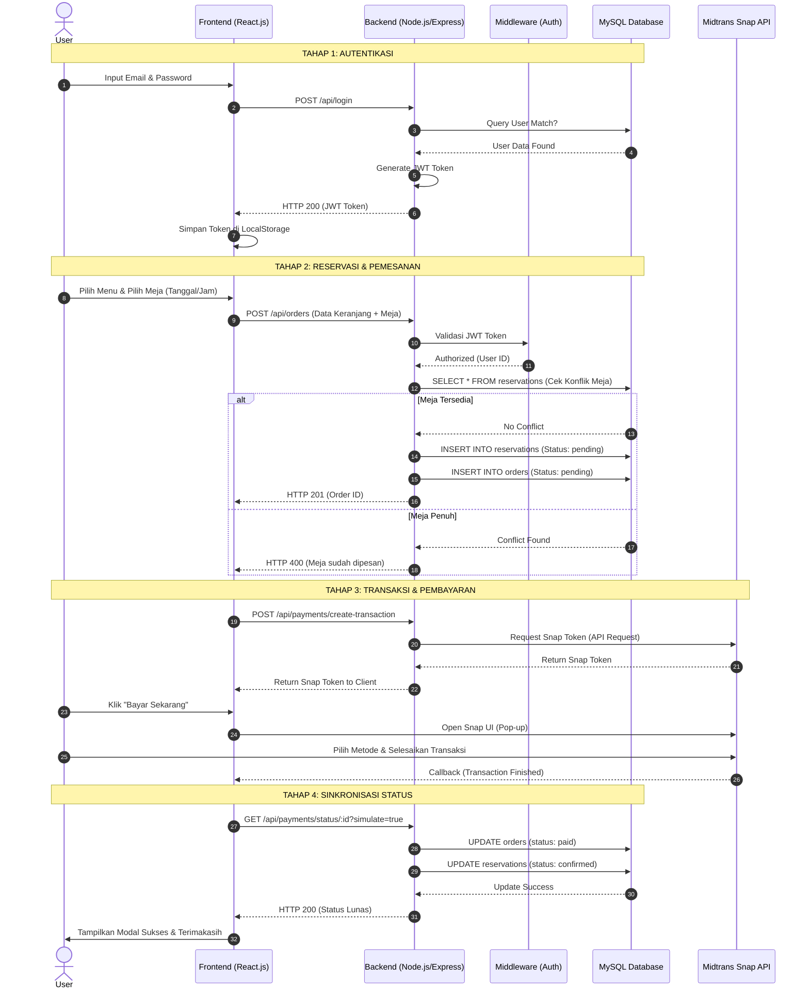

# Dokumentasi Arsitektur Sistem Ineri Suki & Grill (Versi Skripsi)

Dokumentasi ini dirancang untuk memenuhi standar teknis karya ilmiah/skripsi, menjelaskan interaksi antar komponen sistem secara mendalam.

---

## 1. Use Case Diagram
Menjelaskan fungsionalitas sistem dari sudut pandang aktor (User & Admin).

---

## 2. Activity Diagram: Alur Reservasi & Pembayaran
Menjelaskan aliran aktivitas user dari mulai memilih menu hingga pembayaran selesai.

---

## 3. Sequence Diagram: Alur Utama Sistem (End-to-End)
Diagram ini mencakup proses Autentikasi, Reservasi, Cek Ketersediaan, hingga Pembayaran.

---

## 4. Komponen Teknologi (Stack)
- **Frontend**: React.js (Vite), TailwindCSS.
- **Backend**: Node.js, Express.js.
- **Database**: MySQL (Aiven Cloud / Local).
- **Payment Gateway**: Midtrans Snap API.
- **Security**: JSON Web Token (JWT).
