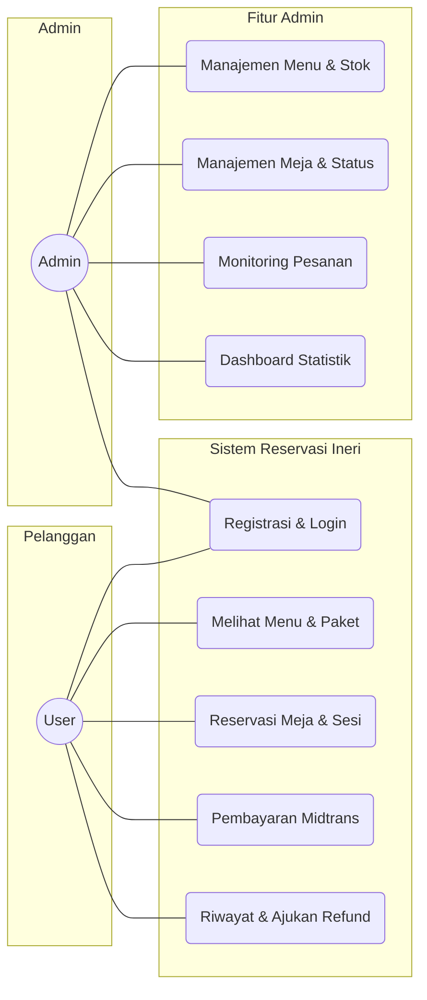
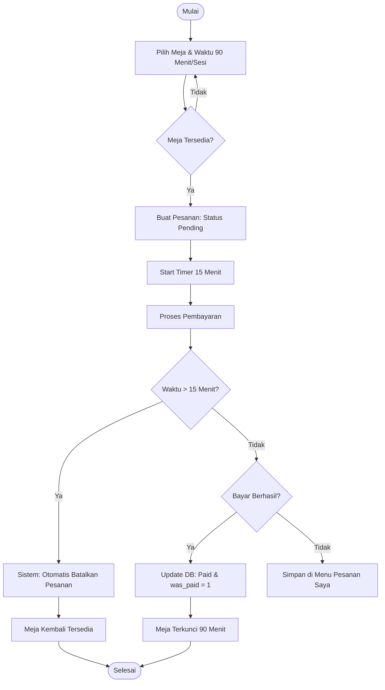
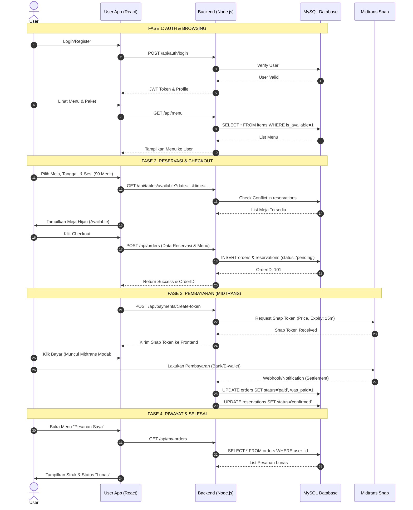
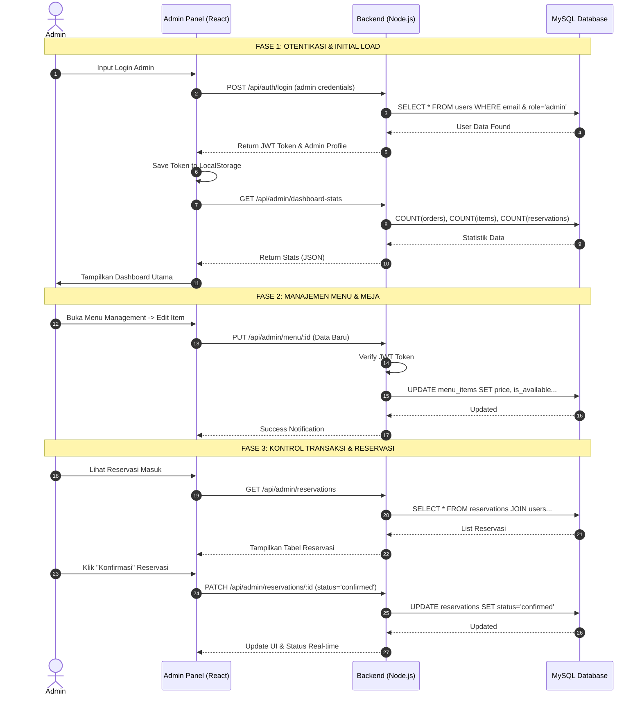

# Dokumentasi Arsitektur Sistem Ineri Suki & Grill (Edisi Final Skripsi)

Dokumentasi ini dirancang untuk memenuhi standar teknis karya ilmiah, menjelaskan logika otomatisasi tingkat lanjut yang telah diimplementasikan dalam sistem.

---

## 1. Use Case Diagram
Menjelaskan interaksi antara Aktor (Pelanggan & Admin) dengan sistem.

---

## 2. Activity Diagram: Alur Reservasi & Pembayaran (Timer 15 Menit)
Menjelaskan logika *time-bound* untuk pembayaran dan pembersihan meja.

---

## 3. Sequence Diagram: Full User Lifecycle (End-to-End)
Diagram ini menjelaskan perjalanan pelanggan dari login, pemesanan, hingga pembayaran sukses.

---

## 4. Sequence Diagram: Full Admin Management System (End-to-End)
Diagram ini menjelaskan siklus lengkap Admin dalam mengelola ekosistem Ineri Suki & Grill.

---

## 5. Aturan Bisnis & Kebijakan Sistem (Operational Excellence)

### A. Kebijakan Waktu (Time Management)
| Fitur | Durasi | Keterangan |
| :--- | :--- | :--- |
| **Batas Bayar** | 15 Menit | Sejak pesanan dibuat. Jika lewat, meja otomatis dilepas. |
| **Durasi Makan** | 60 Menit | Waktu standar pelanggan di meja. |
| **Cleaning Buffer** | 30 Menit | Waktu bagi staf untuk membersihkan panggangan/meja. |
| **Total Sesi** | 90 Menit | Jeda antar reservasi pada meja yang sama. |

### B. Keamanan Database (Data Integrity)
- **Flag `was_paid`**: Digunakan sebagai bukti permanen bahwa transaksi pernah sukses, mencegah manipulasi permintaan refund pada pesanan yang tidak pernah dibayar.
- **Auto-Sync Table**: Jika pesanan dibatalkan (`cancelled`), status meja di tabel `dining_tables` otomatis kembali menjadi `available`.

---

## 5. Komponen Teknologi (Stack)
- **Frontend**: React.js 18, TailwindCSS.
- **Backend**: Node.js (Express), JWT Authentication.
- **Database**: MySQL (Aiven Cloud/Local).
- **Payment**: Midtrans Snap SDK.
- **Diagrams**: Mermaid.js Integration.
