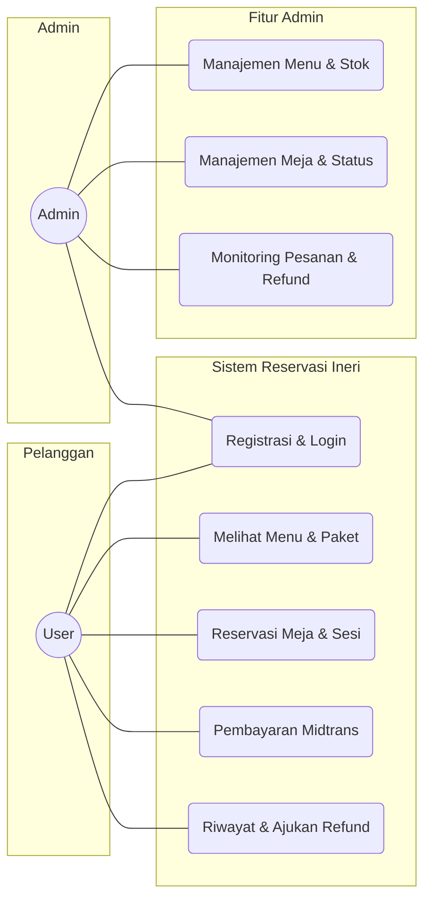
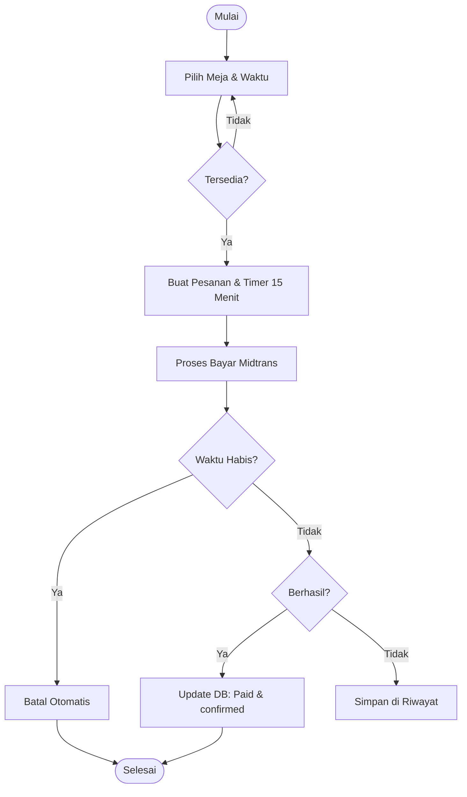
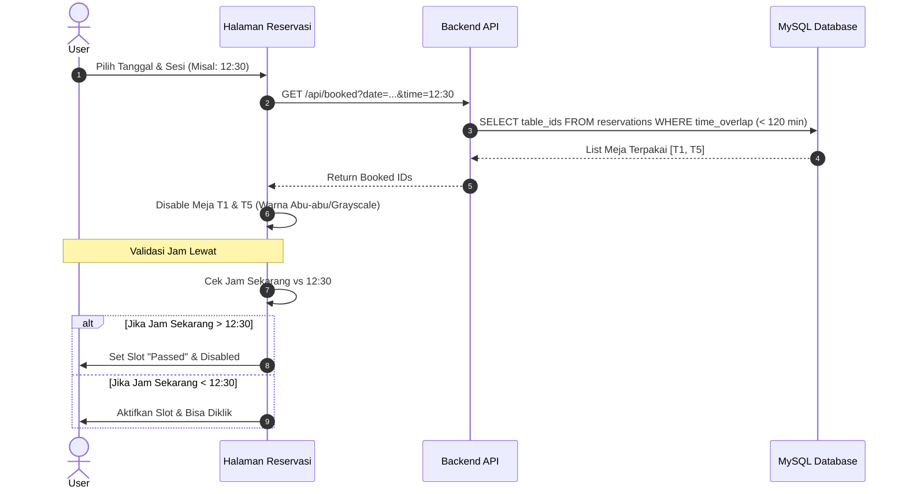
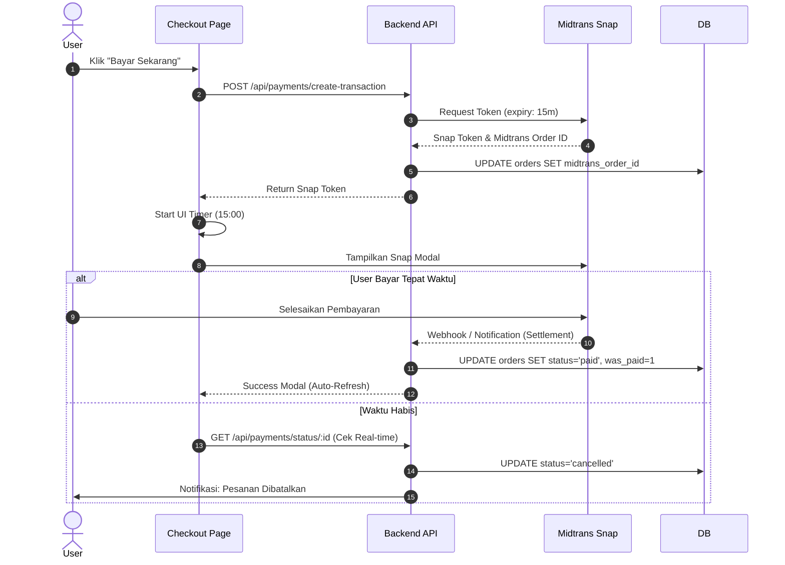
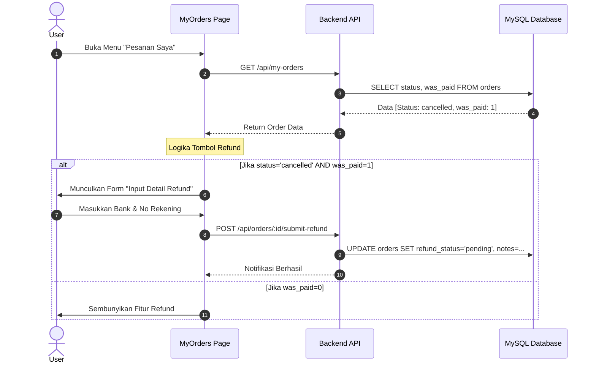
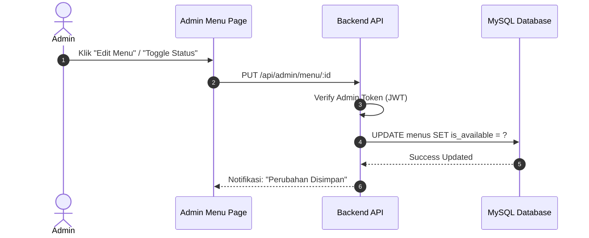
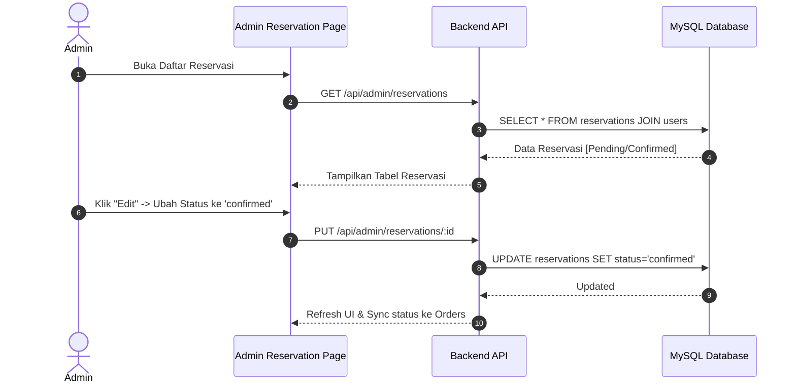
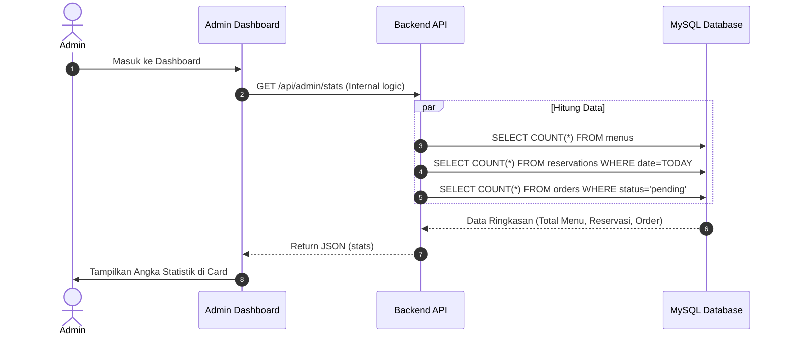

# Dokumentasi Arsitektur Sistem Ineri Suki & Grill (Edisi Skripsi - Per Fitur)

---

## 1. Use Case Diagram
Menjelaskan fungsionalitas sistem secara garis besar.

---

## 2. Activity Diagram: Alur Utama Sistem
Menjelaskan aliran aktivitas user dari awal hingga akhir.

---

## 3. Sequence Diagram (Berdasarkan Fitur Utama)

### A. Fitur Reservasi Meja & Validasi Sesi (Overlap 120 Menit)
Fitur ini menjamin tidak ada bentrokan meja. Sesi 90 menit dengan buffer blokir sesi berikutnya (Total overlap check 120 menit).

### B. Fitur Pembayaran Berwaktu (15 Menit) & Midtrans
Fitur inti yang mengelola urgensi transaksi menggunakan Snap Token.

### C. Fitur Riwayat & Detail Refund
Menjelaskan bagaimana user mengirimkan detail rekening untuk refund jika pesanan batal tapi sudah bayar.

---

## 4. Sequence Diagram (Sisi Admin - Per Fitur)

### A. Fitur Manajemen Menu & Kontrol Stok
Menjelaskan bagaimana Admin mengelola ketersediaan menu.

### B. Fitur Monitoring & Konfirmasi Reservasi
Menjelaskan alur Admin dalam memantau dan mengubah status reservasi secara manual.

### C. Fitur Dashboard & Statistik Real-time
Menjelaskan bagaimana dashboard menarik data ringkasan untuk performa resto.

---

## 5. Aturan Bisnis & Kebijakan Sistem (Updated)
- **Sesi Reservasi**: Slot 90 Menit (60 Menit makan + 30 Menit bersih-bersih).
- **Blokir Overlap**: Sistem mengecek bentrokan dalam rentang **120 Menit** untuk memastikan jeda antar pelanggan aman.
- **Batas Pembayaran**: **15 Menit** sejak order dibuat. Jika lewat, status otomatis `cancelled`.
- **Booking Fee**: Rp 10.000 per meja. Jika terjadi pembatalan (No-Show), kebijakan internal menyatakan **Rp 5.000 hangus** (sebagai denda slot), sisa dana paket dikembalikan.
- **Validasi Refund**: Hanya muncul jika `was_paid = 1` dan status pesanan `cancelled`.
- **Keamanan**: Akses Admin dilindungi Middleware JWT dan pengecekan `role = 'admin'`.
