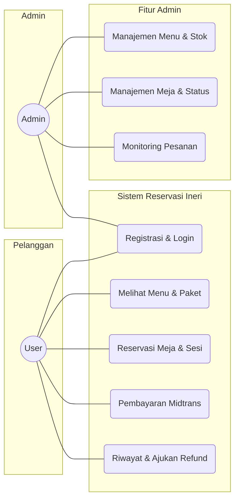
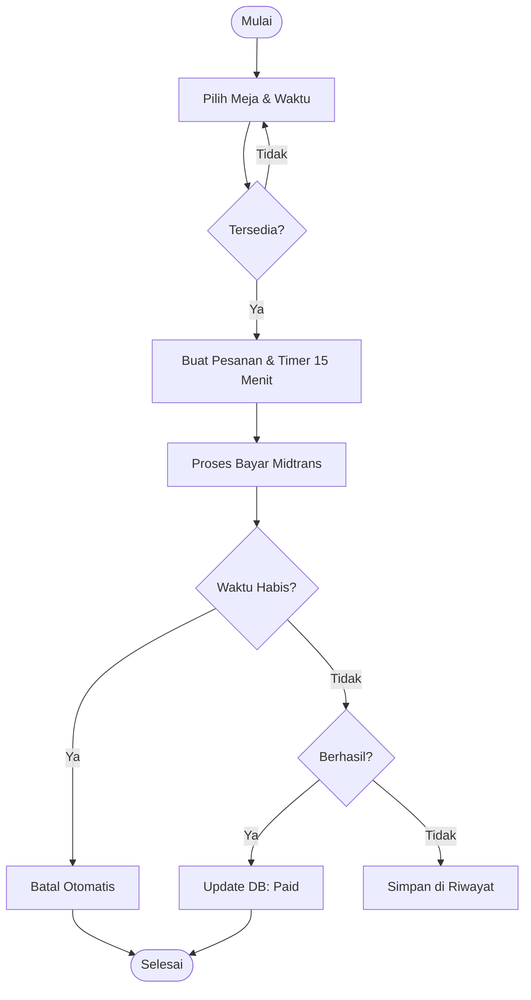
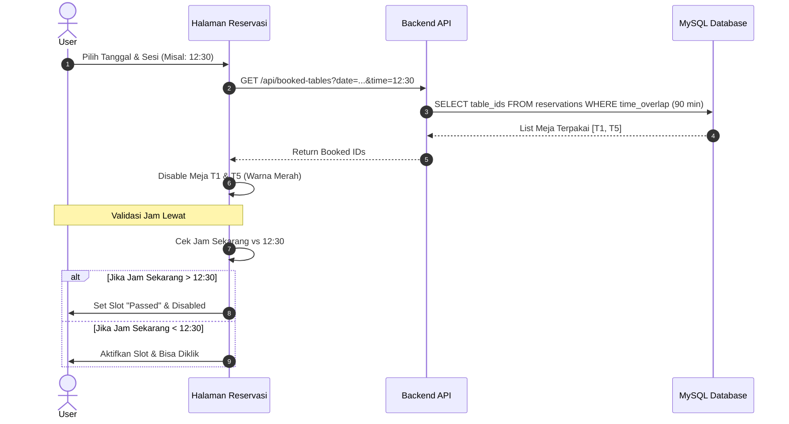
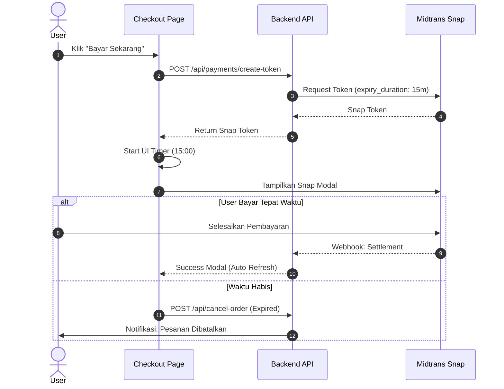
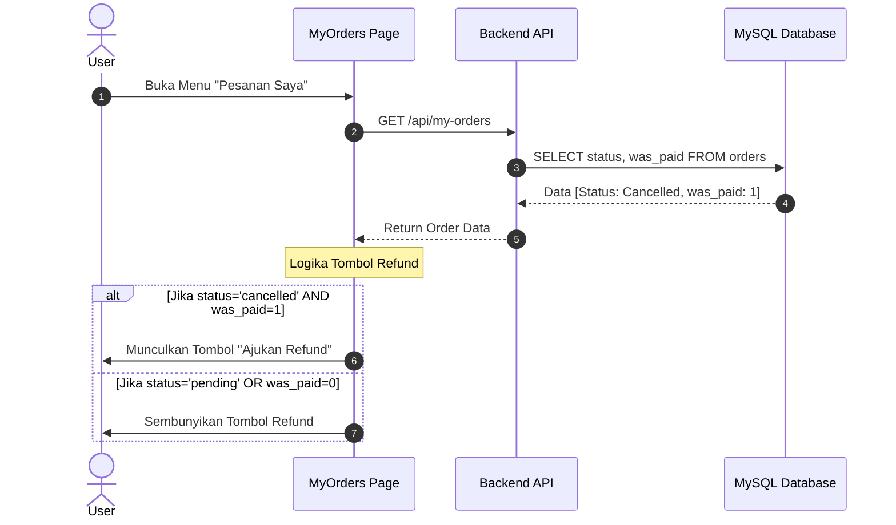
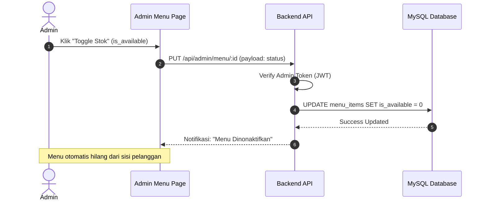
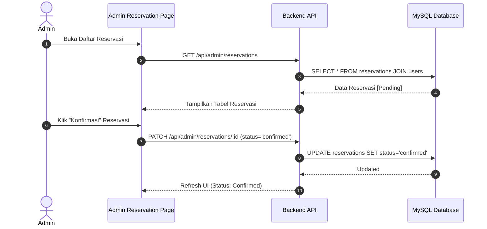
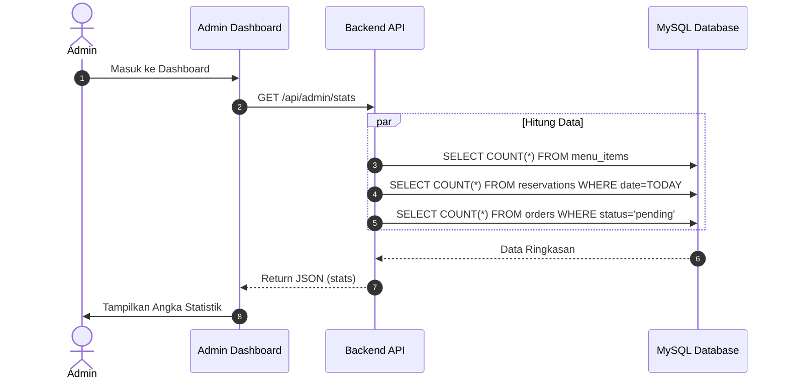

# Dokumentasi Arsitektur Sistem Ineri Suki & Grill (Edisi Skripsi - Per Fitur)

---

## 1. Use Case Diagram
Menjelaskan fungsionalitas sistem secara garis besar.

---

## 2. Activity Diagram: Alur Utama Sistem
Menjelaskan aliran aktivitas user dari awal hingga akhir.

---

## 3. Sequence Diagram (Berdasarkan Fitur Utama)

### A. Fitur Reservasi Meja & Validasi Sesi (90 Menit)
Fitur ini menjamin tidak ada bentrokan meja dan waktu yang sudah lewat tidak bisa dipilih.

### B. Fitur Pembayaran Berwaktu (15 Menit) & Midtrans
Fitur inti yang mengelola urgensi transaksi.

### C. Fitur Riwayat & Validasi Refund (Keamanan Dana)
Menjelaskan mengapa refund hanya muncul jika pesanan benar-benar pernah dibayar.

---

## 4. Sequence Diagram (Sisi Admin - Per Fitur)

### A. Fitur Manajemen Menu & Kontrol Stok
Menjelaskan bagaimana Admin mengelola menu dan bagaimana perubahannya berdampak pada sisi user.

### B. Fitur Monitoring & Konfirmasi Reservasi
Menjelaskan alur Admin dalam memantau dan mengonfirmasi jadwal pelanggan.

### C. Fitur Dashboard & Statistik Real-time
Menjelaskan bagaimana dashboard menarik data ringkasan dari database.

---

## 5. Aturan Bisnis & Kebijakan Sistem
- **Sesi Reservasi**: 60 Menit makan + 30 Menit bersih-bersih (Total 90 Menit blokir).
- **Batas Pembayaran**: 15 Menit flat.
- **Validasi Refund**: Hanya untuk pesanan dengan flag `was_paid = 1`.
- **Keamanan**: Akses Admin dilindungi JWT (JSON Web Token).
