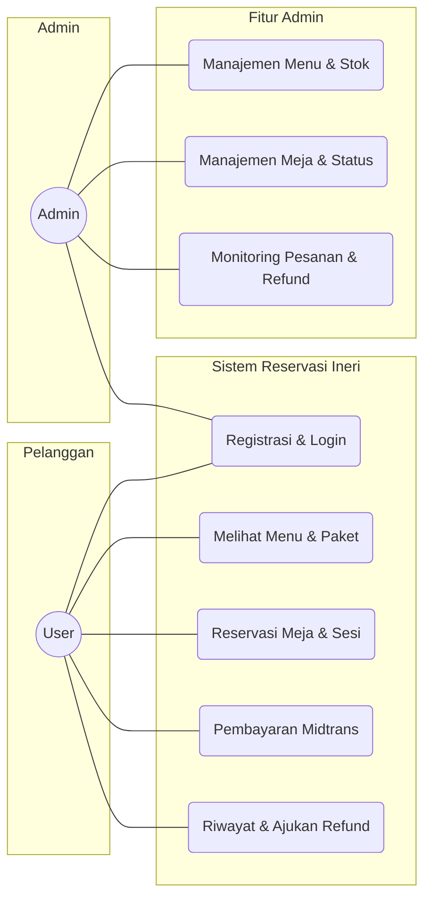
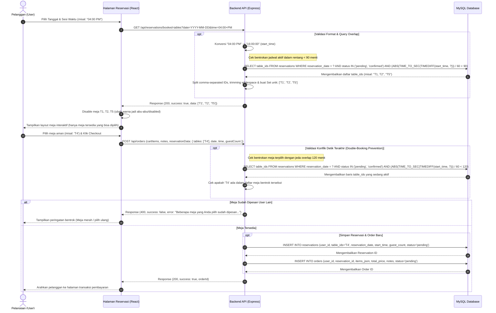
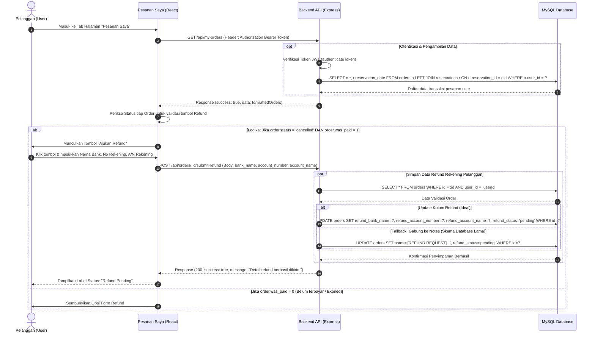
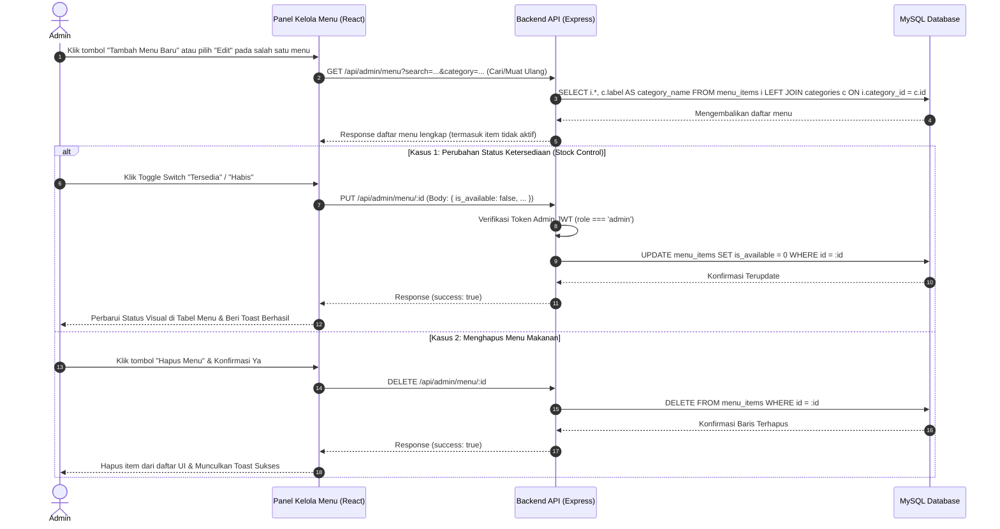
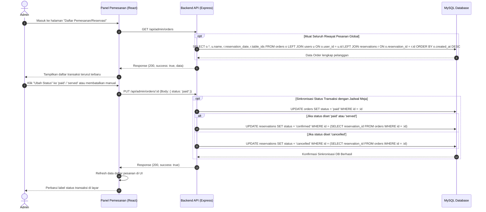
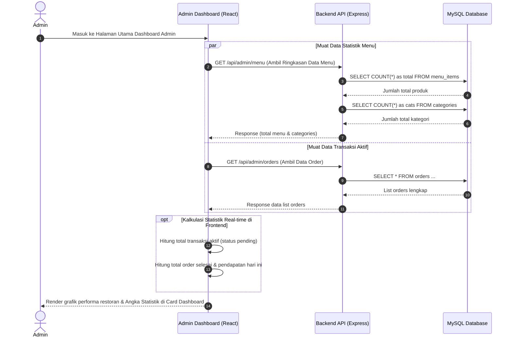

# Dokumentasi Arsitektur Sistem Ineri Suki & Grill (Edisi Skripsi - Per Fitur)

---

## 1. Use Case Diagram
Menjelaskan fungsionalitas sistem secara garis besar.

---

## 2. Activity Diagram: Alur Utama Sistem
Menjelaskan aliran aktivitas user dari awal hingga akhir.

---

## 3. Sequence Diagram (Berdasarkan Fitur Utama - Sisi User)

### A. Fitur Reservasi Meja & Validasi Sesi (Overlap 120 Menit)
Fitur ini menjamin tidak ada bentrokan meja. Sistem mengecek ketersediaan secara real-time pada jam reservasi (sesi 90 menit dengan toleransi bentrok overlap 120 menit).

---

### B. Fitur Pembayaran Berwaktu (15 Menit) & Midtrans
Mengelola batas waktu penyelesaian pembayaran sejak pemesanan dibuat menggunakan sistem Snap Token Midtrans.

```mermaid
sequenceDiagram
    autonumber
    actor User as Pelanggan (User)
    participant FE as Halaman Checkout (React)
    participant BE as Backend API (Express)
    participant DB as MySQL Database
    participant PG as Midtrans Gateway

    User->>FE: Klik "Bayar Sekarang"
    FE->>BE: POST /api/payments/create-transaction (Body: orderId, amount, customerDetails)
    
    opt Penyiapan Data Transaksi & Pajak
        BE->>DB: SELECT * FROM orders WHERE id = orderId
        DB-->>BE: Data Order (items_json, total_price)
        BE->>BE: Parse items_json, hitung Pajak (10%) & Service Fee (5%)
        BE->>BE: Bangun parameter transaksi Midtrans (expiry set: 15 menit)
    end
    
    rect rgb(40, 40, 40)
        BE->>PG: Request Snap Token (snap.createTransaction(parameter))
        PG-->>BE: Mengembalikan Snap Token & midtrans_order_id
        BE->>DB: UPDATE orders SET midtrans_order_id = ? WHERE id = ?
    end
    
    BE-->>FE: Response (200, success: true, snapToken)
    
    FE->>FE: Mulai Hitung Mundur UI Timer (15:00 menit)
    FE->>PG: Buka Snap Modal Popup (window.snap.pay(token))
    PG-->>User: Tampilkan Panel Pembayaran Midtrans (Virtual Account/Gopay)
    
    alt Aksi 1: User Bayar Tepat Waktu (< 15 menit)
        User->>PG: Selesaikan Pembayaran di Aplikasi Bank/E-wallet
        
        rect rgb(40, 40, 40)
            PG->>BE: Webhook / Notification (transaction_status: settlement/capture)
            BE->>BE: Verifikasi keabsahan notifikasi (snap.transaction.notification)
            BE->>DB: UPDATE orders SET status='paid', was_paid=1 WHERE id = orderId
            BE->>DB: UPDATE reservations SET status='confirmed' WHERE id = reservationId
            BE-->>PG: Response OK (200)
        end
        
        FE->>BE: GET /api/payments/status/:orderId (Polling / Cek Manual)
        BE->>DB: SELECT status FROM orders WHERE id = orderId
        DB-->>BE: Status: 'paid'
        BE-->>FE: Response (success: true, newStatus: 'paid')
        FE-->>User: Tampilkan Modal Sukses & Arahkan ke halaman Sukses
        
    else Aksi 2: Waktu Habis / Pembayaran Kedaluwarsa (> 15 menit)
        FE->>BE: GET /api/payments/status/:orderId
        BE->>DB: SELECT status, created_at, reservation_id FROM orders WHERE id = orderId
        DB-->>BE: Data Order
        
        opt Cek Kedaluwarsa & Pembatalan Otomatis
            BE->>BE: Hitung selisih waktu (Sekarang - created_at) > 15 menit
            BE->>DB: UPDATE orders SET status='cancelled' WHERE id = orderId
            BE->>DB: UPDATE reservations SET status='cancelled' WHERE id = reservationId
        end
        
        BE-->>FE: Response (success: false, message: "Waktu habis. Pesanan dibatalkan.", status: 'cancelled')
        FE->>FE: Tutup Snap Modal & Hentikan Timer
        FE-->>User: Tampilkan Pesan "Waktu Pembayaran Habis / Pesanan Dibatalkan"
    end
```

---

### C. Fitur Riwayat & Detail Refund (User Side)
Menjelaskan bagaimana pelanggan mengirimkan data detail rekening bank jika pesanan dibatalkan (`cancelled`) namun sudah sempat terbayar (`was_paid = 1`).

---

## 4. Sequence Diagram (Sisi Admin - Per Fitur)

### A. Fitur Manajemen Menu & Kontrol Stok
Menjelaskan bagaimana Admin mengelola menu makanan, memperbarui ketersediaan bahan/stok secara real-time.

---

### B. Fitur Monitoring & Konfirmasi Reservasi
Menjelaskan alur Admin dalam memantau seluruh transaksi pemesanan masuk dan mengubah status reservasi pelanggan secara manual.

---

### C. Fitur Dashboard & Statistik Real-time
Menjelaskan proses pengumpulan statistik performa restoran secara ringkas dan real-time pada dashboard utama admin.

---

## 5. Aturan Bisnis & Kebijakan Sistem (Skripsi Verified)
- **Sesi Reservasi**: Durasi slot reservasi adalah **90 Menit** (terbagi atas 60 menit durasi makan pelanggan + 30 menit pembersihan & penyiapan meja kembali).
- **Blokir Overlap**: Sistem backend secara ketat memblokir pemesanan meja yang bentrok dalam rentang **120 Menit** untuk memastikan adanya waktu jeda pembersihan yang aman bagi meja bersangkutan.
- **Batas Pembayaran**: Waktu penyelesaian pembayaran adalah **15 Menit** sejak pesanan pertama kali dibuat. Jika lewat 15 menit dan status masih *pending*, status pesanan & reservasi otomatis diubah menjadi `cancelled`.
- **Kebijakan Booking Fee**: Nilai booking fee sebesar Rp 10.000 per meja. Jika terjadi pembatalan/dibatalkan manual oleh admin, kebijakan restoran menetapkan **Rp 5.000 hangus** sebagai denda slot, sedangkan sisa uang pembayaran menu akan dikembalikan utuh.
- **Validasi Refund**: Menu input refund hanya akan muncul bagi pelanggan jika pesanan tersebut berstatus `cancelled` namun telah terbayar (`was_paid = 1`).
- **Otentikasi & Keamanan**: Akses dashboard admin diproteksi secara berlapis menggunakan Middleware JWT, memverifikasi tanda tangan session JWT, dan mencocokkan hak akses pengguna (`role === 'admin'`).
