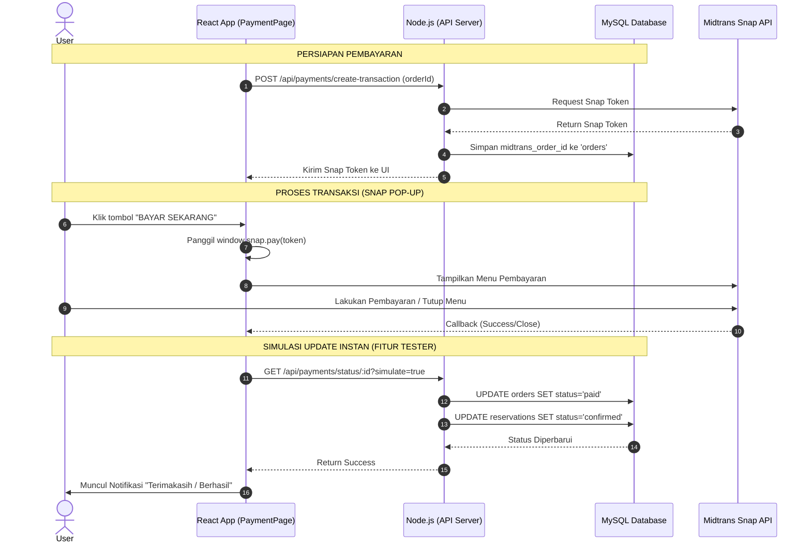
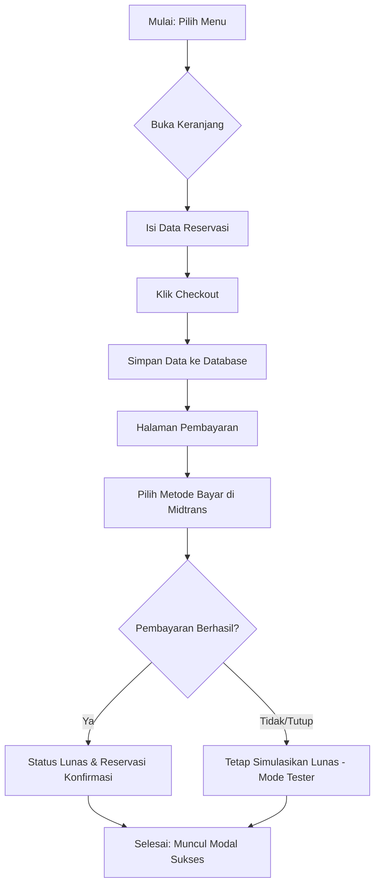

# Dokumentasi Alur Aplikasi Ineri Suki & Grill

Dokumentasi ini menggunakan **Mermaid** untuk menjelaskan alur logika sistem.

## 1. Sequence Diagram: Proses Pembayaran (Snap Midtrans)
Diagram ini menjelaskan urutan komunikasi antara User, Frontend, Backend, dan API Midtrans.

---

## 2. Flowchart: Alur Pemesanan & Reservasi
Diagram alir proses dari pemilihan menu hingga selesai.

---

## Cara Melihat Diagram Ini:
1. Di **VS Code**: Tekan `Ctrl + Shift + V` saat membuka file ini untuk melihat preview diagramnya.
2. Di **GitHub**: File ini akan otomatis berubah menjadi gambar diagram yang rapi.
