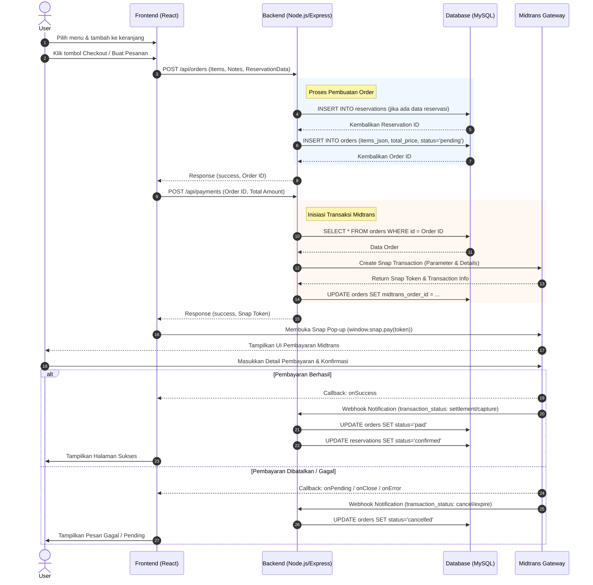

# Sequence Diagram: Pemesanan Menu & Pembayaran (Midtrans)

Berikut adalah *sequence diagram* yang menggambarkan alur proses pemesanan menu mulai dari penambahan item ke keranjang hingga proses pembayaran selesai melalui Midtrans Gateway.

### Penjelasan Langkah-langkah:
1. **Pembuatan Order (Langkah 1-6)**: Pengguna melakukan proses checkout dari keranjang. Sistem backend akan menyimpan data reservasi (jika meja dipesan) dan data pesanan (menu) ke database dengan status awal `pending`.
2. **Inisiasi Pembayaran (Langkah 7-12)**: Frontend meminta *Snap Token* dengan mengirimkan `Order ID`. Backend membangun parameter (termasuk pajak dan biaya layanan) dan mengirimkannya ke API Midtrans untuk mendapatkan *Snap Token*.
3. **Proses Pembayaran (Langkah 13-15)**: Dengan menggunakan token, frontend membuka *pop-up* pembayaran Midtrans. Pengguna menyelesaikan pembayaran langsung di antarmuka Midtrans.
4. **Konfirmasi & Webhook (Langkah 16-21)**: Setelah pembayaran selesai, Midtrans mengirimkan notifikasi *Webhook* di belakang layar secara langsung ke Backend. Backend memperbarui status pesanan menjadi `paid` dan status reservasi menjadi `confirmed`. Di saat yang bersamaan, Frontend memberikan respon visual kepada pengguna.
