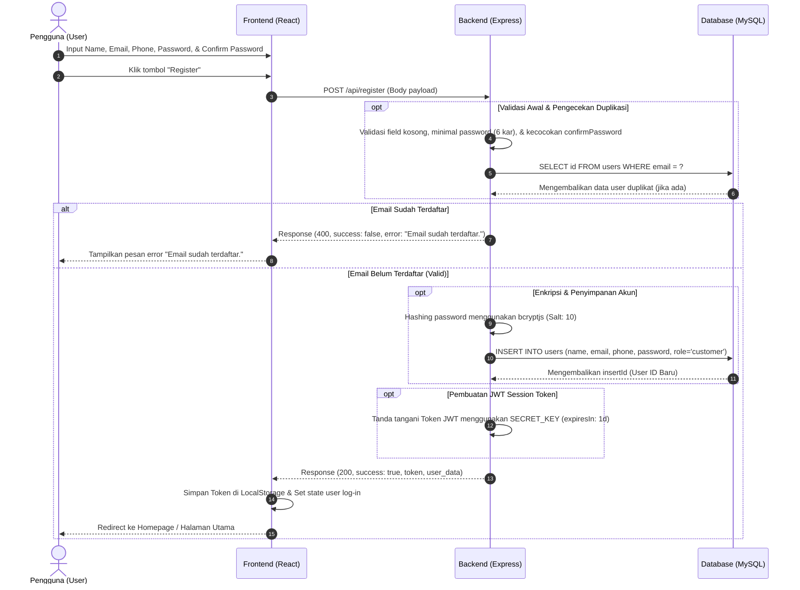
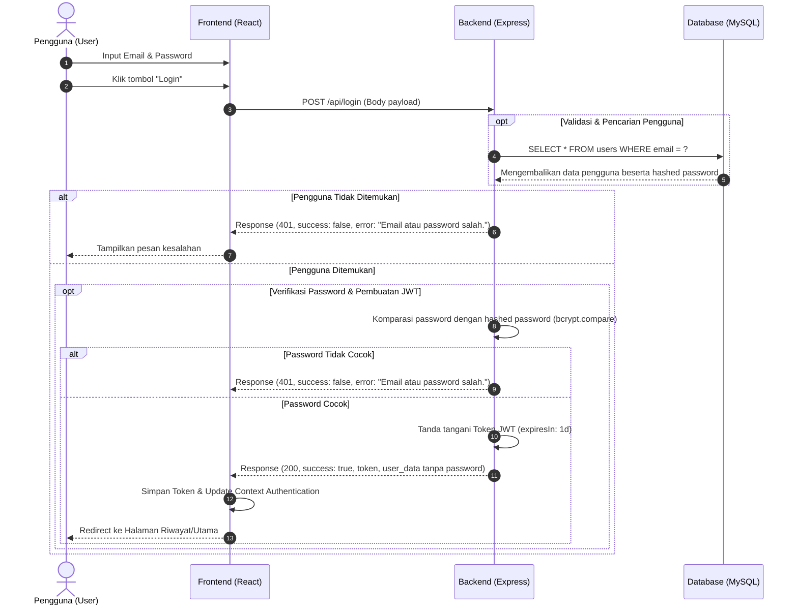
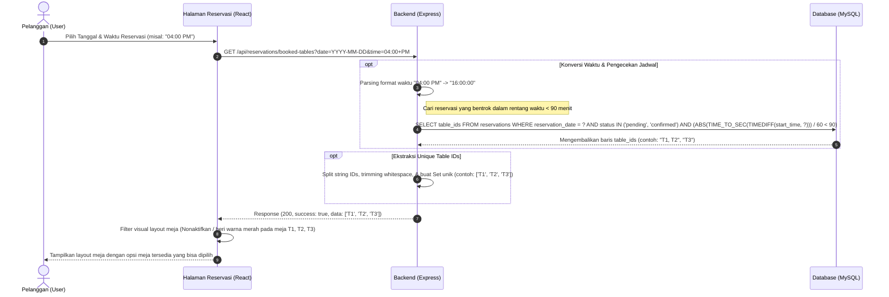
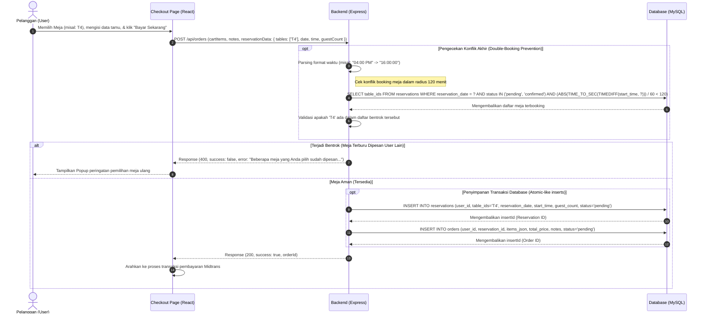
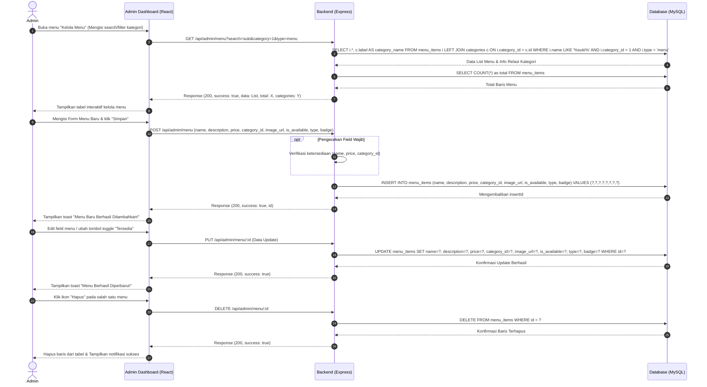

# Sequence Diagrams: Fitur Utama Aplikasi Ineri Suki & Grill

Dokumen ini berisi *sequence diagram* mendetail untuk setiap fitur utama di platform Ineri Suki & Grill. Semua diagram ini menggunakan pembatas kompatibel *dark mode* (`opt`) dan menjelaskan alur API, query database (MySQL), enkripsi, hingga validasi.

---

## 1. Fitur: Registrasi & Login Pengguna (Authentication)

Fase ini menjelaskan proses registrasi akun baru dan masuk (*login*) baik untuk Pelanggan (Customer) maupun Admin.

### A. Alur Registrasi Akun Baru (Register)

### B. Alur Masuk Akun (Login)

---

## 2. Fitur: Reservasi Meja & Pemilihan Waktu (Table Reservation)

Fitur ini mencakup pengecekan meja yang sudah dipesan secara real-time pada waktu tertentu, pencegahan konflik bentrok meja, dan penyimpanan data reservasi yang terikat dengan pemesanan menu (*Cart Items*).

### A. Pengecekan Ketersediaan Meja (Check Availability)

### B. Pembuatan Reservasi & Pencegahan Bentrok Saat Checkout

---

## 3. Fitur: Kelola Menu Makanan (Admin Menu Management CRUD)

Bagian ini memaparkan alur admin mengelola menu makanan (menambah, memperbarui status ketersediaan, filter kategori, hingga penghapusan menu).

---

### Penjelasan Struktur File:
- **Authentication**: Mengamankan kata sandi menggunakan `bcryptjs` (Hashing satu arah) sebelum masuk ke database, lalu menggunakan tanda tangan JWT (*JSON Web Token*) untuk identitas *session* pelanggan yang kedaluwarsa dalam 1 hari.
- **Reservasi**: Menyediakan perlindungan tumpang tindih waktu (*overlapping prevention*) dalam cakupan 90-120 menit agar tidak ada dua pelanggan berbeda memesan meja yang sama di waktu yang hampir bersamaan.
- **Menu CRUD**: Memudahkan admin memantau seluruh katalog produk (menu reguler maupun paket) dengan pencarian dinamis yang terintegrasi penuh ke database MySQL.
