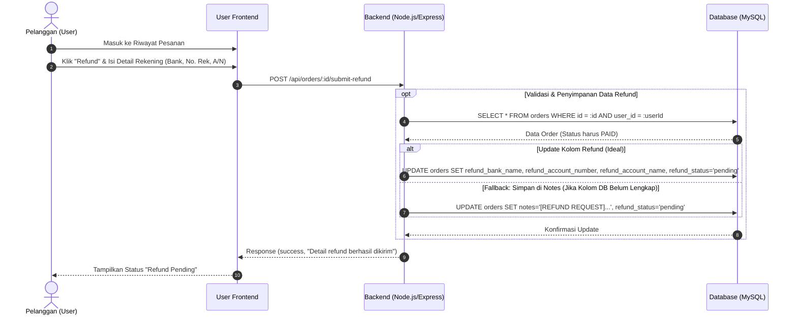
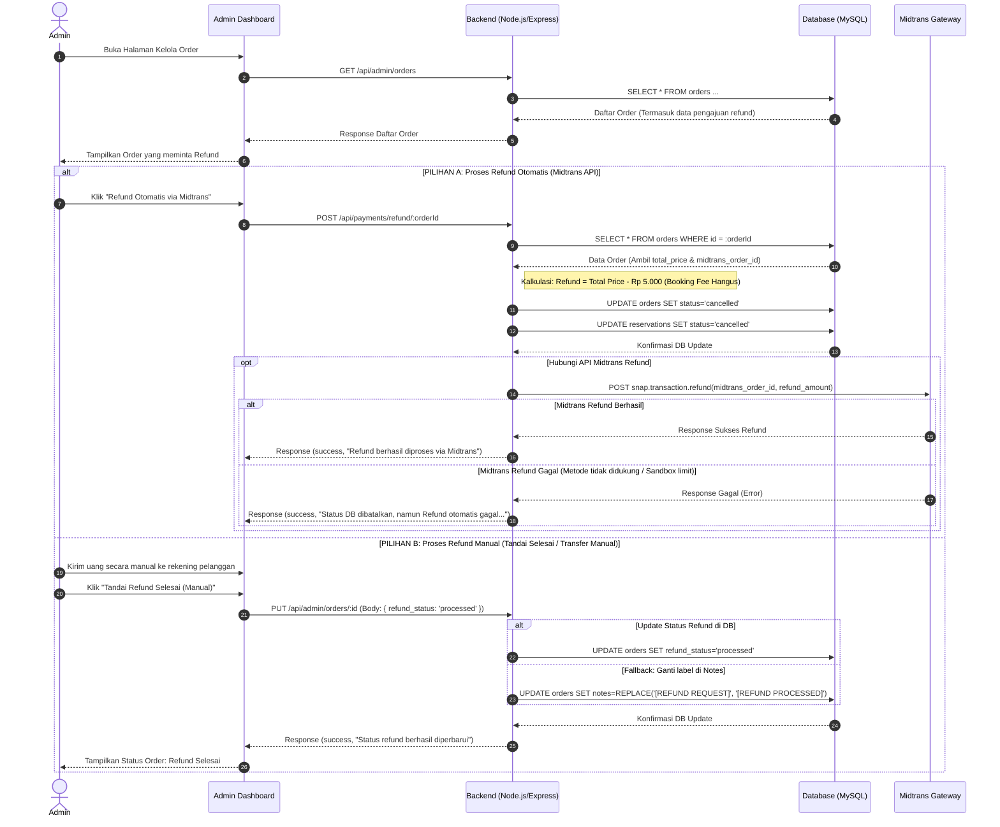

# Sequence Diagram: Proses Refund (Admin & User)

Dokumen ini berisi *sequence diagram* yang menggambarkan alur proses pengajuan refund oleh pelanggan (User) dan pemrosesan refund oleh Admin, baik secara otomatis melalui API Midtrans maupun manual. 

Diagram ini dibagi menjadi dua bagian agar lebih mudah dibaca dan menghindari error *parsing* pada renderer Markdown.

---

## 1. Fase 1: Pengajuan Refund oleh Pelanggan (User)

Fase ini menjelaskan bagaimana pelanggan mengajukan pengembalian dana melalui halaman riwayat pesanan mereka dengan memasukkan detail rekening bank tujuan.

---

## 2. Fase 2: Pemrosesan Refund oleh Admin

Fase ini menjelaskan bagaimana Admin mengelola permintaan refund melalui dashboard, baik menggunakan **API Refund otomatis dari Midtrans** maupun **Transfer Manual**.

---

### Penjelasan Singkat Alur:
- **Fase 1**: Pelanggan mengirimkan rincian akun bank mereka untuk pengembalian dana. Data tersebut disimpan di database dengan status refund `pending`.
- **Fase 2 (Pilihan A)**: Memanfaatkan API Midtrans secara otomatis untuk mengembalikan dana pelanggan setelah dikurangi booking fee Rp 5.000.
- **Fase 2 (Pilihan B)**: Jika pemrosesan otomatis tidak memungkinkan (misalnya karena limitasi sandbox/metode pembayaran tertentu), Admin dapat mentransfer secara manual kemudian menandai transaksi tersebut selesai di dashboard.
